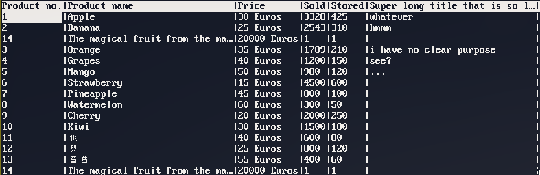

# tabular
Reads a simple .CSV file and allows you to do operations on it



## Running the example

### Acquiring the source
```
git clone https://github.com/thepsauce/tabular.git
cd tabular
```

### Building
```
./build.sh
```

### Now you have these options

Show usage:
- `./tabular`

Print the whole file column by column:
- `./tabular example.csv --all --print`

Print the "Kiwi" column:
- `./tabular example.csv --all --set-row Kiwi --print`

View the table in a TUI:
- `./tabular example.csv --all --view`

View all columns matching "Product\*":
- `./tabular example.csv --all --set-column "Product*" --view`

View the table and make operations, write it to a file after quitting:
- `./tabular example.csv --all --set-column "Product*" --view --output output.csv`

Append a row:
- `./tabular example.csv --append "i;am;new;here" --all --output append.csv`

Tabular uses getopt, the above can be written as:
- `./tabular example.csv -d"i;am;new;here" -aoappend.csv`

Append a column:
- `./tabular example.csv --append-column Value --all --output append_column.csv`

Note: This does not show all options, just the most interesting ones.

## The `--view` option

This option gives you a TUI interface to interact with the table. It is a mode editor, you have three modes: Normal, Insert, Command.

### Normal mode

| | |
|-|-|
| <kbd>ARROW KEYS</kbd> <kbd>hjkl</kbd> | Move the cursor |
| <kbd>HOME</kbd> <kbd>0</kbd> | Move the cursor to the first column |
| <kbd>END</kbd> <kbd>$</kbd> | Move the cursor to the last column |
| <kbd>g</kbd>/<kbd>G</kbd> | Move the cursor to the first/last row |
| <kbd>TAB</kbd> <kbd>SPACE</kbd> | Move to the next cell |
| <kbd>BTAB</kbd> <kbd>BACKSPACE</kbd> | Move to the previous cell |
| <kbd>d</kbd> | Delete the current row |
| <kbd>x</kbd> | Delete the current column |
| <kbd>A</kbd> | Append an empty row |
| <kbd>u</kbd> | Undo |
| <kbd>CTRL+R</kbd> | Redo |
| <kbd>></kbd> | Increase the column width |
| <kbd><</kbd> | Decrease the column width |
| <kbd>r</kbd> | Update all column widths |
| <kbd>i</kbd> | Go to insert mode |
| <kbd>:</kbd> | Go to command mode |
| <kbd>Q</kbd> | Quit |

### Insert mode

| | |
|-|-|
| <kbd>LEFT</kbd> <kbd>RIGHT</kbd> | Move the cursor in the input field |
| <kbd>BACKSPACE</kbd> | Delete previous character |
| <kbd>DEL</kbd> | Delete character |
| <kbd>CTRL</kbd>+<kbd>U</kbd> | Delete line |
| <kbd>HOME</kbd> | Go to the beginning of the line |
| <kbd>END</kbd> | Go to the end of the line |
| <kbd>ENTER</kbd> | Update the cell |
| <kbd>ESC</kbd> | Return to normal mode |

### Command mode

Same as insert mode but pressing enter will run the command, these are all commands:
- i\[nfo\], p\[rint\], w\[rite\] (output), r\[ead\] (input)
- all [A], all-rows [Ar], all-cols [Ac]
- invert [I], invert-rows [Ir], invert-cols [Ic]
- none [N], no-rows [Nr], no-cols [Nc]
- r\[ow\], c\[ol\], set-row [sr], set-col [sc]
- a\[ppend\], append-col [ac]
- undo [U], redo [R]
- q\[uit\]

They have a one to one correspondence to the program options.
